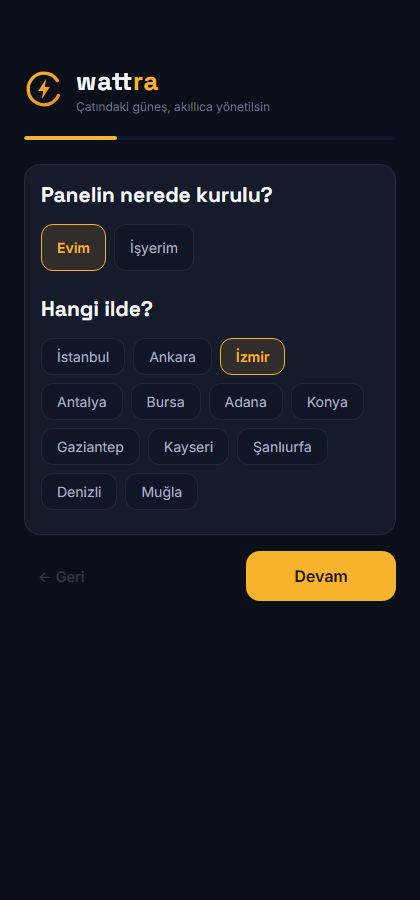
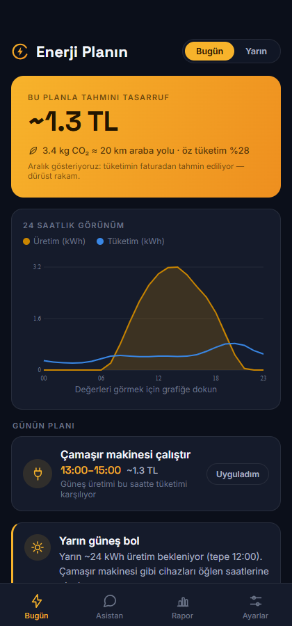
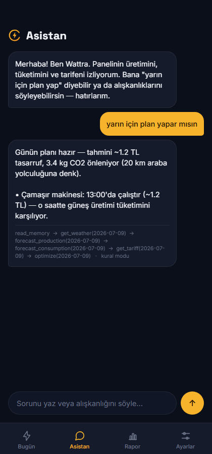

# Takım 62 · ⚡ Voltaic

> **Çatındaki güneş, akıllıca yönetilsin.**
> Türkiye'deki çatı-GES sahibi ev ve küçük işletmeler için; üretim ve tüketimi
> tahmin edip **saatlik mahsuplaşma**, kademeli/üç zamanlı tarife kurallarına göre
> "şu cihazı şu saatte çalıştır" diye sade Türkçe konuşan, alışkanlıkları öğrenen
> ve tasarrufu **TL + CO₂** olarak kanıtlayan agent tabanlı kişisel enerji asistanı.

*(Ürün ismi değerlendirme aşamasındadır; marka çakışması nedeniyle yeni isim
adayları belirlenmiştir.)*

---

## Takım Üyeleri

| İsim | Rol | Odak |
|---|---|---|
| *(eklenecek)* | Product Owner / Developer | Agent mimarisi + kontrat (YZ-1) |
| *(eklenecek)* | Scrum Master / Developer | Orkestrasyon + Gemini (YZ-2) |
| *(eklenecek)* | Developer | Hafıza + arayüz (YZ-3) |
| *(eklenecek)* | Developer | Üretim modeli + veri (VB-1) |
| *(eklenecek)* | Developer | Tüketim modeli + optimizasyon (VB-2) |

## Ürün Açıklaması

Çatısında güneş paneli olan bir ev ya da küçük işletme sahibi, ürettiği enerjiyi
ne zaman depolayacağını, hangi cihazı ne zaman çalıştıracağını bilmiyor. Üstelik
**2 Nisan 2026 mevzuat değişikliğiyle mahsuplaşma saatlik hale geldi**: üretimi
o saat içinde tüketmeyen kullanıcı, sattığı her kWh'te dağıtım bedeli ve vergiler
kadar (~%30) kaybediyor. Voltaic bu kararı kullanıcı adına veriyor:

**"Çamaşırı yarın 13:00'te at — ~9-14 TL ve 2.9 kg CO₂ (17 km araba yoluna denk) tasarruf, çünkü öğlen üretimin tüketimini karşılıyor."**

İki makine öğrenmesi modeli (üretim + tüketim tahmini) agent'ın çağırdığı birer
tool olarak çalışır; Gemini tabanlı agent hangi tool'u ne zaman çağıracağına kendi
karar verir, kullanıcının itirazını hafızasına yazar ve planı yeniden kurar.

## Ürün Özellikleri

- 📱 **Mobil uygulama + web sitesi** (tek Expo/React Native kod tabanı)
- 🗓 **Günlük plan:** cihaz ve batarya için saat saat öneri, gerekçesiyle
- 🤖 **Gerçek agent:** Gemini function-calling; tool zinciri kullanıcıya şeffaf gösterilir
- 🧠 **Öğrenen hafıza:** "Salı öğlen evde yokum" → kaydeder, planı değiştirir
- 💰 **Gerçek Türkiye ekonomisi:** kademeli tarife (240 kWh eşiği), üç zamanlı
  dilimler, saatlik mahsuplaşma, 10 kW mesken sınırı uyarısı — hepsi kaynaklı
- 🌱 **Çevresel etki:** ETKB emisyon faktörüyle CO₂ + "araba km / ağaç" eşdeğerleri
- 📊 **Ay sonu raporu:** gerçekleşen tasarruf + karşı-olgusal "kaçırılan fırsat"
- 🔔 **Proaktif uyarı:** "Yarın güneş bol, çamaşırı öğlene planla" — sorulmadan
- 🌐 Türkçe, sıfır teknik bilgi varsayımı, 4 adımda kurulum (saatlik sayaç verisi İSTEMEZ)

## Hedef Kitle

Türkiye'de çatı-GES sahibi (veya kurmayı değerlendiren) **ev kullanıcıları** ve
**küçük işletmeler** (dükkan, atölye, tarımsal sulama) — teknik bilgisi olmayan,
faturasını düşürmek ve güneşinden en yüksek faydayı almak isteyen herkes.

## Ekran Görüntüleri

| Onboarding | Günlük Plan | Asistan |
|---|---|---|
|  |  |  |

## Teknik Dokümantasyon

- [docs/TEKNIK.md](docs/TEKNIK.md) — mimari, kurulum, depo yapısı, kalan işler
- [docs/CONTRACT.md](docs/CONTRACT.md) — model–agent tool kontratı (kilitli, v1.1)
- [docs/METHOD.md](docs/METHOD.md) — veri doğruluğu, mevzuat kaynakları, dürüstlük ilkeleri
- [docs/DEPLOY.md](docs/DEPLOY.md) — çalıştırma, Docker, canlıya alma, demo videosu akışı

**Hızlı başlangıç:** `backend/` → `pip install -r requirements.txt` → `uvicorn app.main:app` ·
`mobile/` → `npm install` → `npx expo start` (testler: `pytest tests/` — 14/14)

---

# Sprintler

<h2>Sprint 1 — İskelet ve Kontrat (19 Haziran – 5 Temmuz)</h2>

**Sprint hedefi:** Uçtan uca iskelet çalışsın; model–agent kontratı kilitlensin,
modeller baseline versin, agent tool çağırabilsin.

**Sprint puanı:** *(takım board'una göre eklenecek — önerilen: toplam 300 puanın 100'ü)*

### Tamamlanan işler

- ✅ Model–agent tool kontratı tasarlandı ve **kilitlendi** (Pydantic şemaları + CONTRACT.md)
- ✅ FastAPI backend + Docker iskeleti; SQLite kalıcılık
- ✅ 6 tool: canlı Open-Meteo hava, PV üretim modeli (v0 fiziksel), tüketim profili
  (fatura kalibrasyonu), EPDK tarife (kademeli + üç zamanlı + **saatlik mahsuplaşma**),
  optimizasyon motoru, hafıza
- ✅ Gemini function-calling agent döngüsü + anahtarsız kural-tabanlı fallback
- ✅ Müzakere: itiraz → hafızaya yaz → yeniden planla (canlı doğrulandı)
- ✅ Expo mobil uygulama + web sitesi (onboarding, plan, asistan, rapor, ayarlar)
- ✅ Marka kimliği: koyu tema, SVG logo/ikonlar, Space Grotesk + Inter
- ✅ Mevzuat/veri doğrulaması: 2026 tarifeleri, RG 02.04.2026 saatlik mahsup,
  ETKB emisyon faktörü — kaynaklar METHOD.md'de
- ✅ 14 birim/entegrasyon testi + headless tarayıcıyla uçtan uca duman testi
- ✅ Karşı-olgusal ay sonu raporu + proaktif uyarılar + CO₂/çevresel eşdeğerler

### Ürün durumu

Yukarıdaki ekran görüntüleri Sprint 1 sonunda çalışan üründen alınmıştır
(gerçek Open-Meteo verisi, İzmir).

### Daily Scrum

*(Takım WhatsApp/Slack özetleri buraya veya `docs/sprint1/daily/` klasörüne eklenecek)*

### Sprint Board

*(Board ekran görüntüsü eklenecek — GitHub Projects önerilir)*

### Sprint Review

*(Toplantı özeti eklenecek. Not: "Yarınki üretim tahmini agent üzerinden dönüyor"
demo kriteri sağlandı — plan + asistan akışı canlı çalışıyor.)*

### Sprint Retrospective

*(Toplantı özeti eklenecek)*

<h2>Sprint 2 — Karar ve Agent Zekası (6 – 19 Temmuz)</h2>

**Hedef:** LightGBM üretim modeli v1, tüketim modeli v1, EPİAŞ şekil doğrulaması,
Gemini anahtarıyla uçtan uca agent testi, Chroma hafıza (opsiyonel).

*(Sprint sonunda doldurulacak)*

<h2>Sprint 3 — Farklılaştırma, Cila ve Teslim (20 Temmuz – 2 Ağustos)</h2>

**Hedef:** Model değerlendirme raporu, canlı URL (Railway/Cloud Run), APK (EAS),
3 dk demo videosu, teslim formu.

*(Sprint sonunda doldurulacak)*

---

*Google Yapay Zeka ve Teknoloji Akademisi Bootcamp 2026 · Yapay Zeka & Veri Bilimi kategorisi*
