# Takım 62 · ⚡ WATTRA

> **Çatındaki güneş, akıllıca yönetilsin.**
> Türkiye'deki çatı-GES sahibi ev ve küçük işletmeler için; üretim ve tüketimi
> tahmin edip **saatlik mahsuplaşma**, kademeli/üç zamanlı tarife kurallarına göre
> "şu cihazı şu saatte çalıştır" diye sade Türkçe konuşan, alışkanlıkları öğrenen
> ve tasarrufu **TL + CO₂** olarak kanıtlayan agent tabanlı kişisel enerji asistanı.

---

## Takım Üyeleri

Ekip 5 kişidir; herkes aktif geliştirici olarak katkı verir.
Scrum rolleri ekip içinde dağıtılmıştır.

| Rol | İsim | Odak |
|---|---|---|
| Product Owner / Developer | Elanur DEMİR | Ürün vizyonu + backlog + üretim modeli (YZ) |
| Scrum Master / Developer | Meltem ÖZEN | Süreç + iletişim + tüketim modeli & optimizasyon (VB) |
| Developer | Berkan ÖKSÜZ | Agent mimarisi + model–agent kontratı + müzakere (VB) |
| Developer | İshak Bedir YORGANCI | Orkestrasyon + Gemini Türkçe öneri + servisler (YZ) |
| Developer | Kübra GEZİCİ | Hafıza + mobil/web arayüz + tarife tool'u (YZ) |

## Ürün Açıklaması

Çatısında güneş paneli olan bir ev ya da küçük işletme sahibi, ürettiği enerjiyi
ne zaman depolayacağını, hangi cihazı ne zaman çalıştıracağını bilmiyor. Üstelik
**2 Nisan 2026 mevzuat değişikliğiyle mahsuplaşma saatlik hale geldi**: üretimi
o saat içinde tüketmeyen kullanıcı, sattığı her kWh'te dağıtım bedeli ve vergiler
kadar (~%30) kaybediyor. Wattra bu kararı kullanıcı adına veriyor:

**"Çamaşırı yarın 13:00'te at — ~9-14 TL ve 2.9 kg CO₂ (17 km araba yoluna denk) tasarruf, çünkü öğlen üretimin tüketimini karşılıyor."**

İki makine öğrenmesi modeli (üretim + tüketim tahmini) agent'ın çağırdığı birer
tool olarak çalışır; Gemini tabanlı agent hangi tool'u ne zaman çağıracağına kendi
karar verir, kullanıcının itirazını hafızasına yazar ve planı yeniden kurar.

## Ürün Özellikleri

- 📱 **Mobil uygulama + web sitesi** (tek Expo/React Native kod tabanı)
- 🗓 **Günlük plan:** cihaz ve batarya için saat saat öneri, gerekçesiyle
- 🤖 **Gerçek agent:** Gemini function-calling; tool zinciri kullanıcıya şeffaf gösterilir
- 🧠 **Öğrenen hafıza:** "Salı öğlen evde yokum" → kaydeder, planı değiştirir
- 💰 **Gerçek Türkiye ekonomisi:** kademeli tarife (240 kWh eşiği), üç zamanlı
  dilimler, saatlik mahsuplaşma, 10 kW mesken sınırı uyarısı — hepsi kaynaklı
- 🌱 **Çevresel etki:** ETKB emisyon faktörüyle CO₂ + "araba km / ağaç" eşdeğerleri
- 📊 **Ay sonu raporu:** gerçekleşen tasarruf + karşı-olgusal "kaçırılan fırsat"
- 🔔 **Proaktif uyarı:** "Yarın güneş bol, çamaşırı öğlene planla" — sorulmadan
- 🌐 Türkçe, sıfır teknik bilgi varsayımı, 4 adımda kurulum (saatlik sayaç verisi İSTEMEZ)

## Hedef Kitle

Türkiye'de çatı-GES sahibi (veya kurmayı değerlendiren) **ev kullanıcıları** ve
**küçük işletmeler** (dükkan, atölye, tarımsal sulama) — teknik bilgisi olmayan,
faturasını düşürmek ve güneşinden en yüksek faydayı almak isteyen herkes.

## Product Backlog
[Miro Backlog](https://miro.com/app/board/uXjVHA5ySr8=/?share_link_id=612821934232)

---

# Sprintler

<h2>Sprint 1 (19 Haziran – 5 Temmuz) · 48 SP</h2>

**Sprint Notları:** Bu sprint'te hem projenin temeli atıldı hem de tüm ekibin uyumlu çalışabilmesi için gerekli düzenlemeler yapıldı. Takım rolleri belirlendi. Projede yapılacak tasklar belirlendi ve product backlog olarak boarda eklendi. Repo, GitHub & proje altyapısı düzenlendi. Model-agent kontratı oluşturuldu ve tüm ekibin uyumlu çalışabilmesi için gerekli düzenlemeler yapıldı.

**Tamamlanan Puan:** Sprint 1 için 48 puanlık iş yapılacağı belirlenmiştir ve 48 puanlık iş tamamlanmıştır.

**Tahmin Mantığı:** Yapılacak taskların her biri zorluk, öncelik ve yapılma süresine bağlı olarak puanlandırılmıştır. Tüm sprintler için toplam puan 103'tür. Sprint 1 için 48 puan planlanmış ve 48 puan tamamlanmıştır. Sprint 1'de daha çok projenin iskeletinin oluşturulması, temel fonksiyonların yazılması ve agent'ın test edilmesi hedeflenmiştir. Bu nedenle diğer sprintlere göre daha çok puan verilmiştir.

**Daily Scrum:** Whatsapp üzerinden toplantı saatleri kararlaştırılıp Meet veya Slack üzerinden toplantılar gerçekleştirilmiştir. Bu kısa toplantılarla ekip üyeleri tamamladıkları işleri, yapacakları task'ları ve karşılaştıkları engelleri paylaşarak ilerleme kaydedilmiştir. 

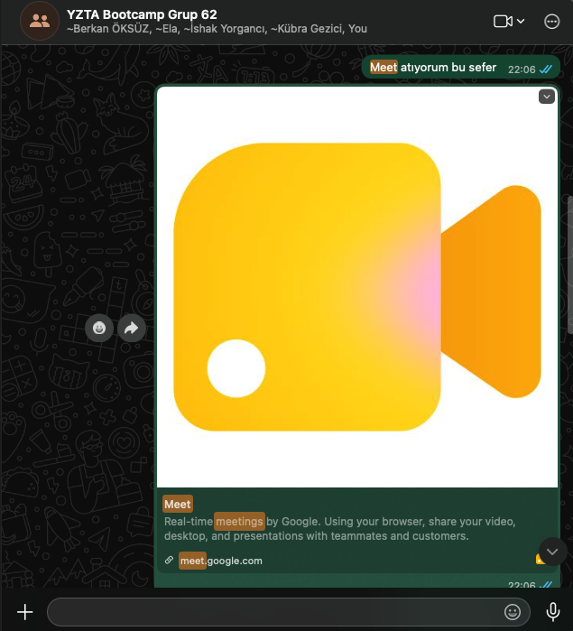

**Scrum Board Ekran Görüntüleri**
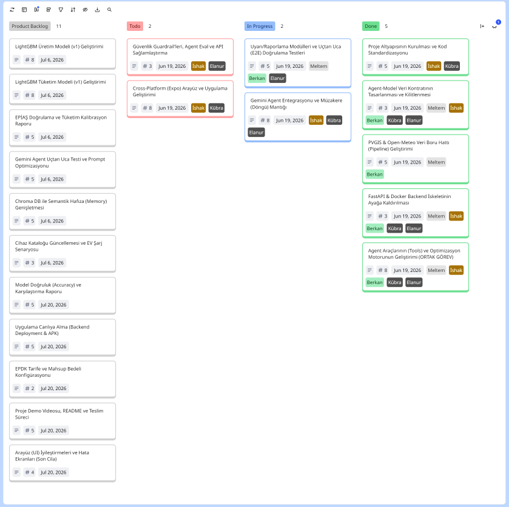

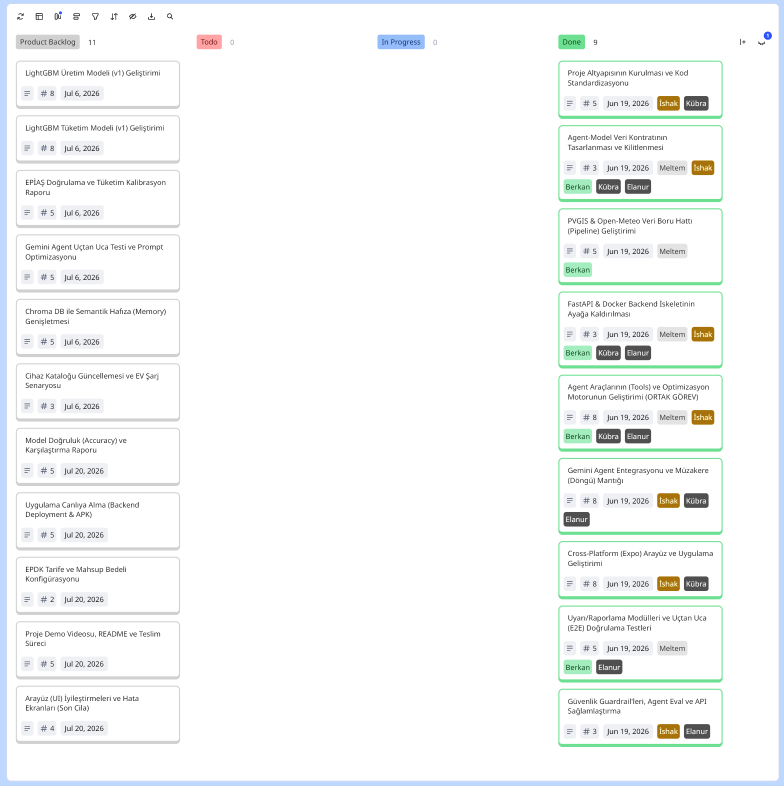

**Sprint 1 Burndown Chart**

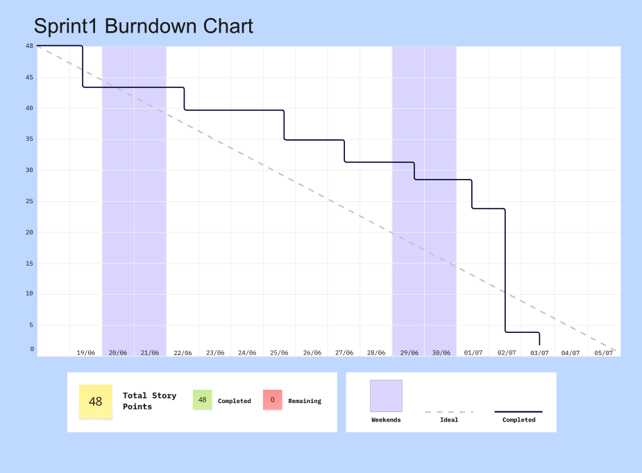

**Sistem Mimari Şeması**
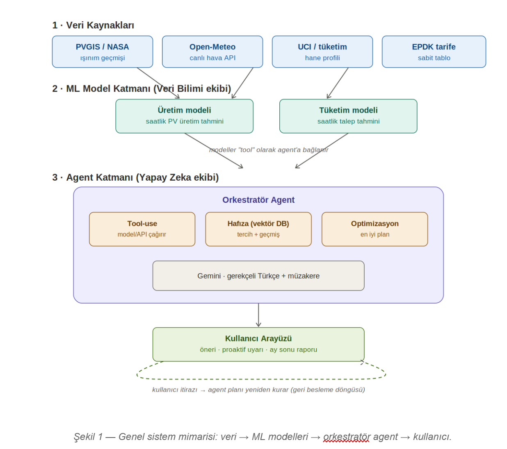

**Ürün Ekran Görüntüleri**

| Onboarding | Günlük Plan | Asistan |
|---|---|---|
|  |  |  |

**Sprint Review:** Hangi veri setlerinin kullanılacağına karar verilip PVGIS ve Open-Meteo API entegrasyonları yapılarak veri çekme scriptleri yazıldı. FastAPI ile backend iskeleti oluşturuldu ve Expo kullanılarak mobil/web uygulamasının temel sayfaları (onboarding, plan, asistan vb.) kodlandı. Ayrıca agent yapısı için 6 farklı tool geliştirilerek optimizasyon motoru devreye alındı ve kapsamlı testlerle (uçtan uca doğrulama) sistem sağlamlaştırıldı.

**Sprint Retrospective:** Diğer 2 sprintte daha verimli çalışılacağına ve daha planlı toplantı yapılması gerektiğine karar verildi.

| # | Görev | Ekip | SP | Durum |
|---|---|---|---|---|
| S1-1 | Repo, GitHub & proje altyapısı + **İngilizce refactor** (dosya/metot/alan adları) + klasör mimarisi | YZ | 5 | ✅ |
| S1-2 | Model–Agent tool kontratını tasarla ve **KİLİTLE** (Pydantic `schemas.py` + CONTRACT.md) | Ortak | 3 | ✅ |
| S1-3 | Veri boru hattı: PVGIS + Open-Meteo çekme/temizleme scriptleri | VB | 5 | ✅ |
| S1-4 | Backend: FastAPI + Docker iskeleti + SQLite kalıcılık | YZ | 3 | ✅ |
| S1-5 | 6 agent tool'u + **optimizasyon motoru** (weather, production v0, consumption v0, tariff+saatlik mahsup, optimize, memory) | VB+YZ | 8 | ✅ |
| S1-6 | Gemini function-calling agent + kural-tabanlı fallback + **müzakere döngüsü** (itiraz → hafıza → yeniden planla) | YZ | 8 | ✅ |
| S1-7 | Mobil + web uygulaması (Expo tek kod tabanı: onboarding, plan, asistan, rapor, ayarlar + grafik + marka) | YZ | 8 | ✅ |
| S1-8 | Proaktif uyarılar + karşı-olgusal ay sonu raporu + CO₂/çevre katmanı + **14 test** & uçtan uca doğrulama | Ortak | 5 | ✅ |
| S1-9 | Grounding guard + agent eval suite + API sağlamlaştırma (20 test, güvenli hata cevabı, grounded fallback) | YZ | 3 | ✅ |

<h2>Sprint 2 (6 – 19 Temmuz) · 34 SP</h2>

**Sprint Notları:** Bu sprint'te tahmin motoru v1 model artifact'leriyle güçlendirildi: üretim modeli LightGBM, tüketim modeli CatBoost olarak yeniden eğitilip v0 ile karşılaştırmalı raporlandı ve tüketim modeli EPİAŞ verisiyle kalibre edildi. Chroma tabanlı semantik hafıza (`search_preferences`) eklendi, cihaz kataloğu ve EV şarj senaryosu güç-bilinçli planlamaya entegre edildi. Gemini agent uçtan uca test edilip prompt'lar optimize edildi.

**Tamamlanan Puan:** Sprint 2 için 34 puanlık iş yapılacağı belirlenmiştir ve 34 puanlık iş tamamlanmıştır.

**Tahmin Mantığı:** Sprint 1'de atılan temel üzerine, Sprint 2'de modellerin v1 sürümlerinin çıkarılması, karşılaştırmalı raporlanması ve agent'ın gerçek veriyle (EPİAŞ, hafıza, cihaz kataloğu) sağlamlaştırılması hedeflenmiştir. Toplam 103 puanın 34'ü bu sprint'e ayrılmış ve tamamı tamamlanmıştır.

**Daily Scrum:** Whatsapp üzerinden iletişime geçilerek Slack huddle'ları üzerinden günlük toplantılar gerçekleştirildi. 

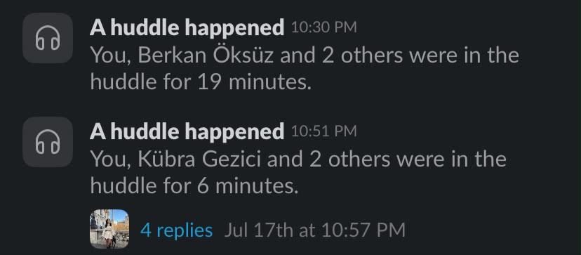

**Scrum Board Ekran Görüntüsü**

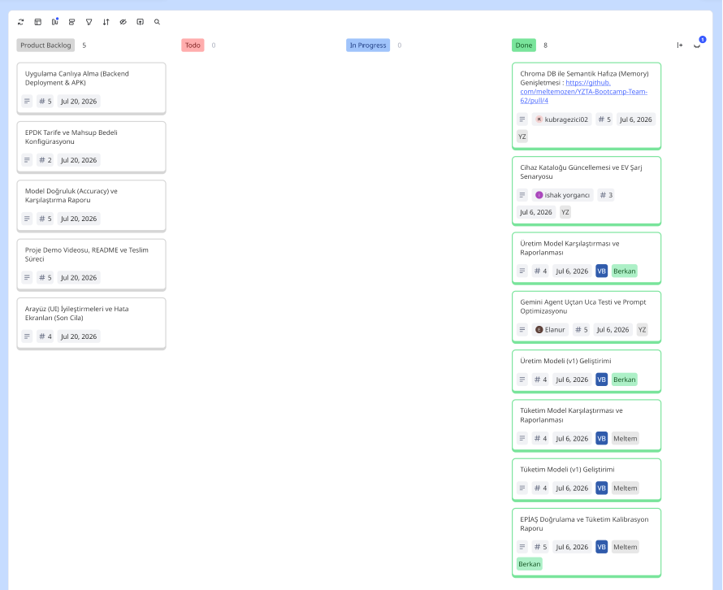

**Sprint 2 Burndown Chart**

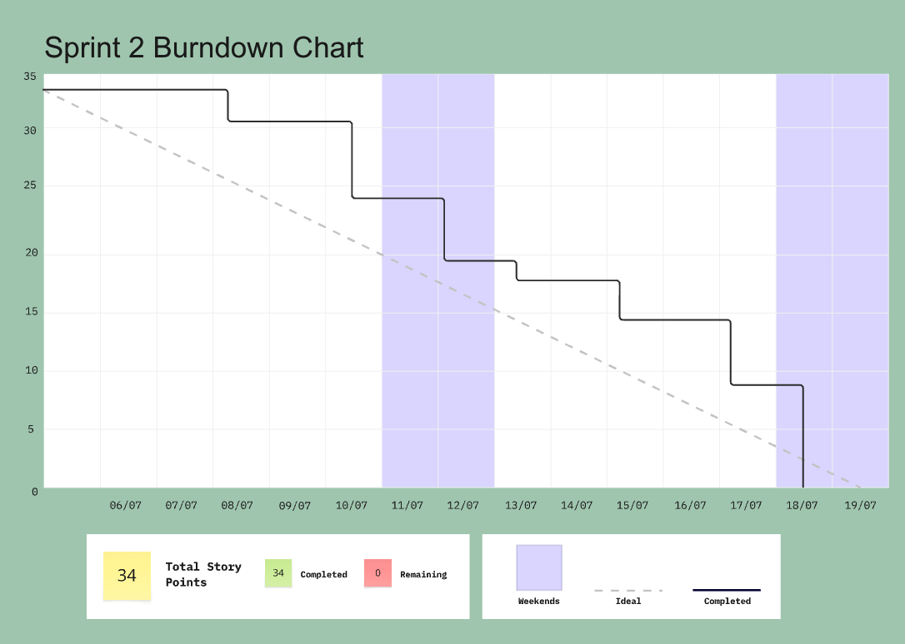

**Ürün Ekran Görüntüleri**

| Asistan | Rapor | Bugün | Yarın | Ayarlar |
|---|---|---|---|---|
| 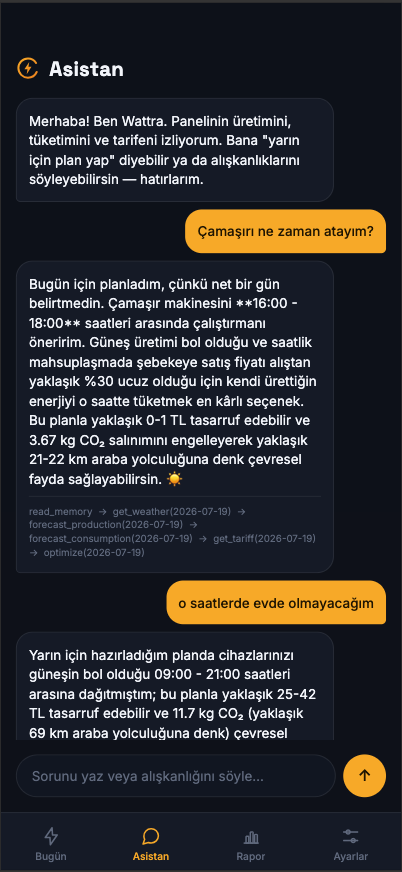 | 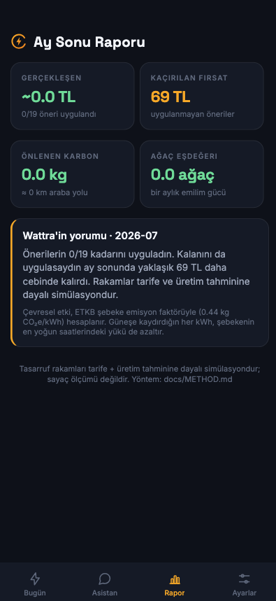 | 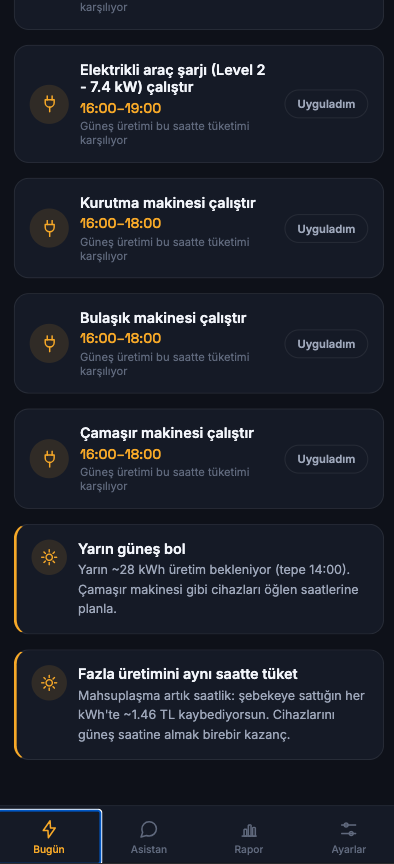 | 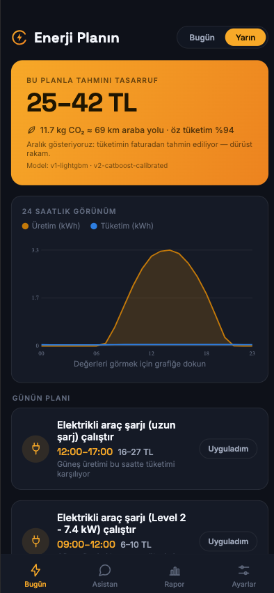 | 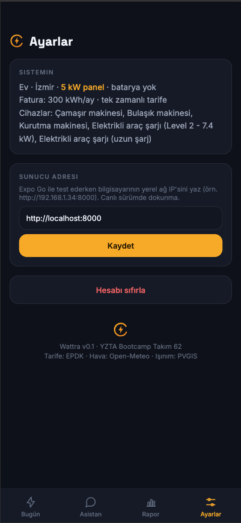 |

**Model Performans Değerlendirmeleri**

Sprint 2 kapsamında, projenin tahmin motorunu güçlendirmek için veri bilimi ekibi tarafından v1 modelleri eğitilmiş ve v0 (baseline) modelleriyle karşılaştırılmıştır. Üretim tarafında LightGBM, tüketim tarafında ise CatBoost modelleri en düşük hata oranlarını vererek projeye entegre edilmiştir. Detaylı araştırma raporlarına `docs/research/` klasöründen ulaşılabilir.

_Üretim Modeli (v0 → v1):_
| Model | MAE | RMSE | nMAE % |
|---|---|---|---|
| **LightGBM (v1 seçilen)** | 0.00335 | 0.00771 | **2.08** |
| XGBoost | 0.00337 | 0.00775 | 2.09 |
| RandomForest | 0.00343 | 0.00801 | 2.13 |
| v0-physical (baseline) | 0.00882 | 0.01605 | 5.47 |

_Tüketim Modeli (v0 → v1):_
| Model | MAE | RMSE |
|---|---|---|
| **CatBoost (v1 seçilen)** | **0.2125** | **0.2641** |
| LightGBM | 0.2247 | 0.2744 |
| Prophet | 0.3688 | 0.4162 |

**Sprint Review:** Üretim modeli LightGBM v1 ve tüketim modeli CatBoost v1, v0 ile karşılaştırmalı şekilde eğitilip raporlandı; tüketim modeli EPİAŞ şekil doğrulamasıyla kalibre edildi. Chroma + Gemini embeddings ile semantik hafıza (`search_preferences`) eklendi. Cihaz kataloğu ve EV şarj senaryosu güç-bilinçli planlamaya dahil edildi. Gemini agent uçtan uca test edilerek prompt'lar iyileştirildi.

**Sprint Retrospective:** Model karşılaştırma ve kalibrasyon işlerinin planlanandan daha fazla zaman aldığı görüldü; Sprint 3'te canlıya alma ve teslim hazırlıklarına daha erken başlanmasına karar verildi.

| # | Görev | Ekip | SP | Durum |
|---|---|---|---|---|
| S2-1 | Chroma DB ile Semantik Hafıza (Memory) Genişletmesi | YZ | 5 | ✅ |
| S2-2 | Cihaz Kataloğu Güncellemesi ve EV Şarj Senaryosu | YZ | 3 | ✅ |
| S2-3 | Tüketim Model Karşılaştırması ve Raporlanması | VB | 4 | ✅ |
| S2-4 | Üretim Model Karşılaştırması ve Raporlanması | VB | 4 | ✅ |
| S2-5 | Gemini Agent Uçtan Uca Testi ve Prompt Optimizasyonu | YZ | 5 | ✅ |
| S2-6 | Tüketim Modeli (v1) Geliştirimi | VB | 4 | ✅ |
| S2-7 | Üretim Modeli (v1) Geliştirimi | VB | 4 | ✅ |
| S2-8 | EPİAŞ Doğrulama ve Tüketim Kalibrasyon Raporu | VB | 5 | ✅ |

<h2>Sprint 3 (20 Temmuz – 2 Ağustos) · 21 SP </h2>

**Hedef:** Modelleri değerlendir, ürünü canlıya al, teslim paketini hazırla.

| # | Görev | Ekip | SP |
|---|---|---|---|
| S3-1 | Model doğruluk raporu (nMAE, hold-out; v0 baseline vs v1) | VB | 5 |
| S3-2 | Canlıya alma: Railway/Cloud Run backend + EAS ile Android APK | Ortak | 5 |
| S3-3 | EPDK güncel tarife + mahsup bedeli son teyidi (`config.py`) | Ortak | 2 |
| S3-4 | 3 dk demo videosu + README finalize + teslim formu | Ortak | 5 |
| S3-5 | Erişilebilirlik + son cila (UI durumları, hata ekranları) | YZ | 4 |

**Teslim (2 Ağustos):** public GitHub repo, canlı URL (varsa), 3 dk YouTube videosu,
eksiksiz teslim formu.

---

*Google Yapay Zeka ve Teknoloji Akademisi Bootcamp 2026 · Yapay Zeka & Veri Bilimi kategorisi*
