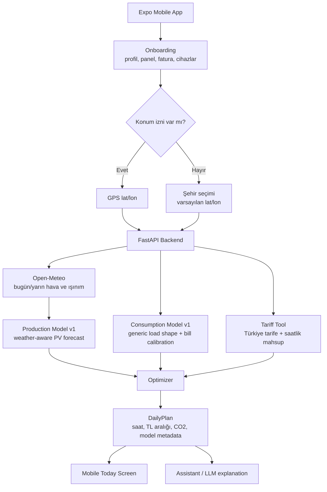
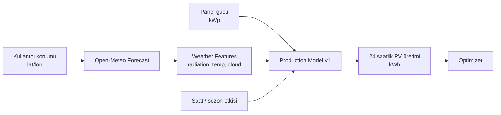
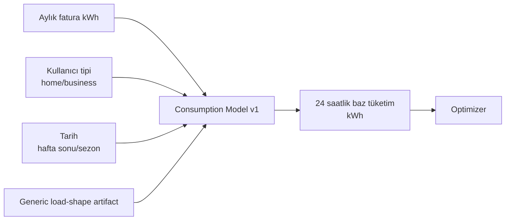
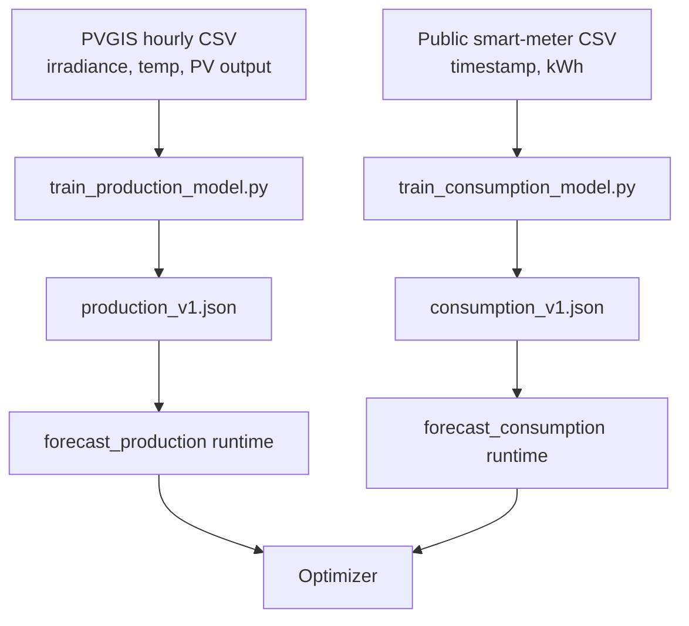
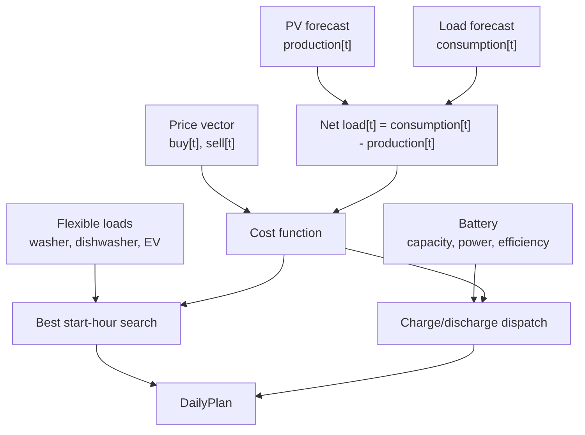
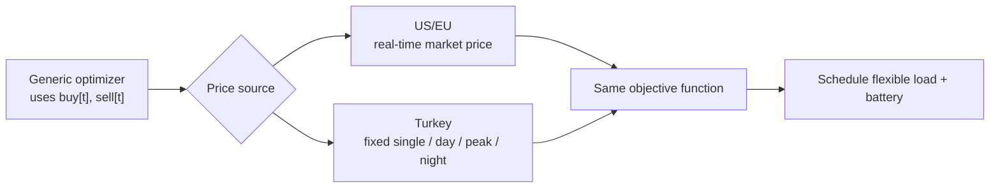
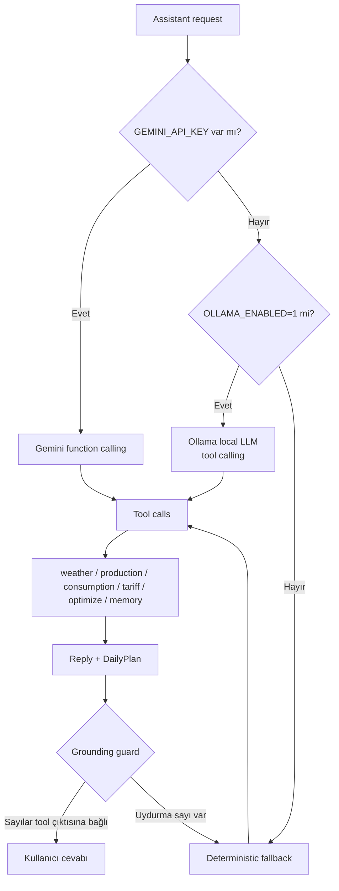
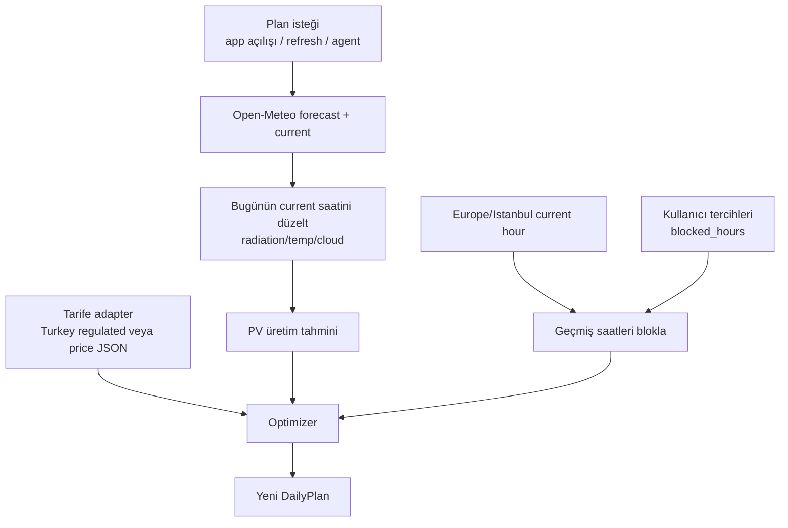

# Voltaic — Sistem Mimarisi ve ML Raporu

> Bu rapor Sprint 2 ve sonrası için teknik mimariyi açıklar: hava durumuna bağlı
> üretim modeli, tüketim modeli, fiyat/tarife optimizasyonu, agent katmanı ve
> Türkiye uyarlaması. Kodun son çalışma branch'i: `ml/s2-weather-local-llm`.

## 1. Executive Summary

Voltaic'in ana iddiası "agent konuşsun" değil; kullanıcının konumu, hava tahmini,
panel gücü, fatura kalibrasyonu ve elektrik tarifesinden **maliyet düşüren günlük
enerji planı** üretmektir. LLM katmanı planı hesaplamaz; planı Türkçe açıklar,
kullanıcı itirazlarını anlar ve hafızaya yazar. Karar motoru deterministik,
testlenebilir ve LLM'den bağımsızdır.

Şu anki ML temeli:

- **Üretim modeli v1:** hava durumu girdisi alır. Open-Meteo'dan gelen kısa dalga
  ışınım, sıcaklık, bulut oranı ve kullanıcının panel gücüyle 24 saatlik PV üretim
  tahmini üretir.
- **Tüketim modeli v1:** generic smart-meter saatlik yük şekli + aylık fatura kWh
  kalibrasyonu kullanır. Şimdilik canlı hava girdisi almaz; sonraki adım sıcaklık
  etkisini tüketime de eklemektir.
- **Optimizasyon:** üretim, tüketim, fiyat ve cihaz/batarya kısıtlarını birleştirip
  en düşük maliyetli saatleri bulur.
- **Gerçek zamanlı adaptasyon:** bugünün planında geçmiş saatler önerilmez; Open-Meteo
  current koşulları bugünün ilgili saatine işlenir; plan her çağrıda yeniden hesaplanır.

## 2. Sistem Akışı



## 3. ML Katmanı

### 3.1 Üretim Modeli: Hava Girdisi Alıyor mu?

Evet. Şu an kullanılan üretim modeli doğrudan hava durumu girdisi alır.

Runtime girdileri:

- `lat`, `lon`: kullanıcı konumu
- `shortwave_radiation`: güneş ışınımı
- `temperature_2m`: sıcaklık
- `cloud_cover`: bulut oranı
- `current` weather: bugünün ilgili saatindeki anlık ışınım/sıcaklık/bulut düzeltmesi
- `panel_kw`: kurulu panel gücü
- `date/hour`: gün ve saat etkisi



Kod karşılığı:

- `backend/app/tools/weather.py`
- `backend/app/tools/production.py`
- `backend/app/models/production_v1.json`
- `data/scripts/train_production_model.py`

Model yaklaşımı şu an bilinçli olarak küçük ve taşınabilir tutuldu. LightGBM'e
kilitlenmeden, PVGIS/Open-Meteo CSV'leriyle yeniden eğitilebilir bir regression
artifact kullanılıyor. Daha sonra aynı contract korunarak LightGBM/XGBoost/pvlib
tabanlı daha güçlü model takılabilir.

### 3.2 Tüketim Modeli

Tüketim modeli kullanıcıdan saatlik sayaç verisi istemez. Bunun yerine generic
smart-meter saatlik yük şekli kullanır ve bunu kullanıcının aylık faturasıyla
ölçekler.



Kod karşılığı:

- `backend/app/tools/consumption.py`
- `backend/app/models/consumption_v1.json`
- `data/scripts/train_consumption_model.py`

Sonraki iyileştirme: tüketim modeline sıcaklık ve nem girdisi eklenebilir. Örneğin
yaz aylarında klima, kış aylarında ısıtma etkisi daha iyi modellenir.

### 3.3 Model Eğitim Akışı



Bu ayrım önemli: sistem yalnızca model dosyasıyla çalışır, eğitim zorunlu runtime
bağımlılığı değildir. Böylece mobil demo ve backend deploy hafif kalır; veri bilimi
ekibi artifact'i geliştirdikçe backend contract bozulmadan model değişir.

## 4. Optimizasyon Mantığı

Genel enerji yönetimi sistemlerinde problem şu şekildedir:

- Güneş üretimi tahmin edilir.
- Tüketim/load tahmin edilir.
- Elektrik alış/satış fiyat vektörü alınır.
- Batarya, EV şarjı ve esnek cihazlar için kısıtlar tanımlanır.
- Amaç fonksiyonu günlük maliyeti minimize eder.



Basit maliyet formu:

```text
net[t] = consumption[t] + flexible_loads[t] + battery_charge[t]
         - production[t] - battery_discharge[t]

cost[t] = net[t] * buy_price[t]       if net[t] > 0
cost[t] = net[t] * sell_price[t]      if net[t] < 0

objective = minimize(sum(cost[t]))
```

Bizim mevcut optimizer exhaustive search ile çalışıyor: her cihaz için geçerli
başlangıç saatlerini dener, en düşük maliyetli pencereyi seçer. Batarya için ise
güneş fazlasında şarj, pahalı saatlerde deşarj mantığı kullanılır.

## 5. ABD / Açık Kaynak Sistemler Nasıl Çalışır?

ABD ve Avrupa'daki ev enerji yönetimi örneklerinde fiyat tarafı çoğu zaman
dinamiktir:

- saatlik toptan piyasa fiyatı,
- real-time pricing,
- time-of-use tariff,
- demand charge,
- net metering / feed-in tariff,
- batarya arbitrajı,
- EV şarj zamanlama.

Açık kaynak ve endüstri referansı olarak kullanılabilecek araçlar:

- **pvlib:** PV sistem performansını modellemek için açık kaynak Python araç seti.
- **NREL SAM / PySAM:** PV, batarya, finansal fizibilite ve dispatch modelleri için
  yaygın kullanılan NREL araçları.
- **EMHASS:** Home Assistant ile çalışan, güneş üretimi, tüketim, batarya ve fiyat
  bilgisiyle load/battery optimizasyonu yapan açık kaynak enerji yönetim yaklaşımı.

Bu sistemlerde fiyat çoğu zaman `price[t]` şeklinde saatlik bir vektördür. Modelin
Türkiye'ye uyarlanması için ana fikir aynıdır; yalnızca fiyat vektörünün kaynağı
değişir.

## 6. Türkiye Uyarlaması

Türkiye'de bizim MVP için fiyat dinamiği daha basittir:

- tek zamanlı tarifede gün içinde fiyat sabit kabul edilir,
- üç zamanlı tarifede üç sabit dilim vardır:
  - gündüz,
  - puant,
  - gece,
- saatlik mahsuplaşma nedeniyle satış fiyatı alış fiyatından düşüktür.

Yani ABD'deki dinamik piyasa fiyatı yerine Türkiye'de şu yapılır:

```text
ABD / real-time:
buy_price[t] = market_price[t] + grid_fees[t]
sell_price[t] = export_price[t]

Türkiye MVP:
buy_price[t] =
  single_price                         tek zamanlı
  day / peak / night fixed price        üç zamanlı

sell_price[t] = buy_price[t] * netmeter_sell_ratio
```

Bu nedenle aynı optimizasyon modeli korunur. Sadece `price[t]` üretim yöntemi
değişir:



Bu bakış bizim proje için güçlüdür: endüstrideki enerji optimizasyon problemini
Türkiye'nin tarife ve mahsuplaşma rejimine uyarlıyoruz. Yani model mantığı generic,
fiyat/tarife adapter'ı ülkeye özgüdür.

Kodda bunun karşılığı:

- Default Türkiye adapter'ı: `backend/app/tools/tariff.py`
- Tarife sabitleri: `backend/app/config.py`
- Araştırma/dinamik fiyat hook'u: `VOLTAIC_PRICE_VECTOR_FILE`
  (`hourly_price` ve opsiyonel `hourly_sell_price` içeren 24 elemanlı JSON).

## 7. Agent / LLM Katmanı

LLM karar motoru değildir. Planı tool çıktıları üretir; LLM sadece kullanıcıyla
etkileşim sağlar.



Bu tasarım yerel LLM denemelerine izin verir ama ürünü Ollama'ya bağımlı yapmaz.
CI/test ortamında Ollama gerekmemesi için local provider opsiyoneldir.

## 8. Gerçek Zamanlı Yeniden Optimizasyon



Bu akış yüzünden plan statik değildir. Kullanıcı öğleden sonra uygulamayı açarsa
sabah saatleri önerilmez. Hava değiştiyse bugünün ilgili saatindeki üretim tahmini
Open-Meteo current değerleriyle güncellenir.

## 9. Şu Anki Durum ve Eksikler

Hazır olanlar:

- Konumdan hava kontrolü.
- Hava girdili PV üretim modeli.
- Generic smart-meter tüketim modeli.
- Türkiye tarife adapter'ı.
- Harici 24 saatlik fiyat vektörü adapter'ı.
- Deterministik optimizer.
- Bugün için geçmiş saatleri dışlayan runtime re-optimization.
- EV şarj ve büyük cihaz metadata katalogu.
- Gemini/Ollama/fallback provider zinciri.
- Grounding guard.
- Backend testleri.

Eksikler:

- PVGIS/Open-Meteo gerçek şehir CSV'leriyle production artifact'i yeniden eğitilmeli.
- Smart-meter dataset ile consumption artifact daha sağlam üretilmeli.
- v0 vs v1 metrikleri raporlanmalı: MAE, nMAE, günlük toplam hata.
- Tüketim modeli sıcaklık etkisiyle weather-aware yapılmalı.
- EV şarj senaryosu büyük esnek yük olarak ayrıntılandırılmalı.
- Batarya optimizasyonu ileride linear programming / MILP yaklaşımına taşınabilir.

## 10. Kaynaklar

- pvlib documentation: https://pvlib-python.readthedocs.io/
- NREL SAM: https://sam.nlr.gov/
- NREL PySAM Battery module: https://nrel-pysam.readthedocs.io/en/main/modules/Battery.html
- EMHASS documentation: https://emhass.readthedocs.io/
- EMHASS GitHub: https://github.com/davidusb-geek/emhass
- Open-Meteo historical/forecast API: https://open-meteo.com/
- PVGIS API: https://joint-research-centre.ec.europa.eu/photovoltaic-geographical-information-system-pvgis/
