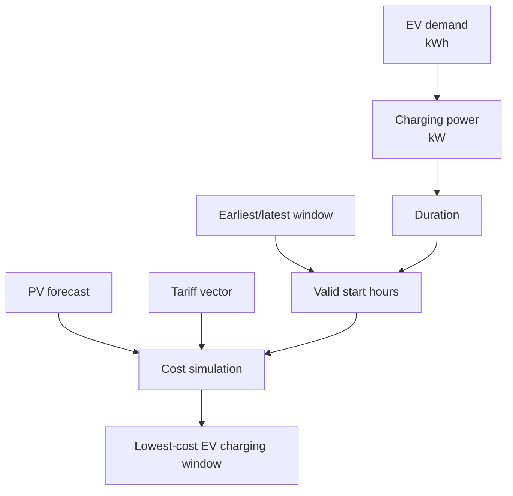

# Cihaz ve EV Varsayımları

Bu not cihaz katalogundaki güç/tüketim varsayımlarını ve EV şarj modelini açıklar.
Amaç kusursuz sayaç doğruluğu değil, kullanıcının kendi cihazını ayarlayabileceği
gerçekçi başlangıç değerleri sağlamaktır.

## 1. Cihaz Modeli

Voltaic'te her esnek cihaz şu alanlarla temsil edilir:

- `name`: kullanıcıya görünen cihaz adı
- `kwh`: bir çalışma döngüsündeki toplam enerji
- `duration_h`: çalışma süresi
- `power_kw`: nominal güç
- `earliest/latest`: çalışabileceği pencere
- `category`: cihaz tipi
- `flexibility`: kaydırılabilirlik

## 2. EV Şarj Modeli

EV şarjı küçük ev aletlerinden farklıdır çünkü tek başına günlük elektrik
tüketimini ciddi değiştirebilir. Bu yüzden katalogda iki EV profili bulunur:

- **Level 2 - 7.4 kW kısa/top-up şarj:** yaklaşık 22 kWh, 3 saat.
- **Uzun şarj:** yaklaşık 37 kWh, 5 saat.

Bu değerler gerçek arabayı birebir temsil etmek zorunda değildir; kullanıcının
günlük şarj ihtiyacını temsil eden ayarlanabilir başlangıç değerleridir.

Kaynaklar:

- EIA, Level 1 ve Level 2 şarj hızları: https://www.eia.gov/energyexplained/use-of-energy/transportation-in-depth.php
- EnergySage, Level 2 şarj cihazı ortalama 7.2 kW: https://www.energysage.com/electricity/house-watts/how-many-watts-does-an-electric-car-charger-use/
- IEA Global EV Outlook, charger güç sınıfları: https://www.iea.org/reports/global-ev-outlook-2025/electric-vehicle-charging
- SEPA, Level 2 şarj 7-20 kW aralığı: https://sepapower.org/knowledge/ev-charging-infrastructure/

## 3. EV Optimizasyonu Nasıl Yapılır?

EV şarjı optimizer'a büyük esnek yük olarak girer. Sistem, aracın hazır olması
gereken son saate kadar tüm geçerli başlangıç saatlerini dener.

Türkiye'de üç zamanlı tarifede EV çoğu zaman gece ucuz saate veya güneş üretimi
yüksekse öğlen güneş penceresine yerleşir. Tek zamanlı tarifede ise temel kazanç
saatlik mahsuplaşma nedeniyle güneş üretimini aynı saatte tüketmektir.

## 4. Gerçekçi Olmayan Durumları Önleme

Uygulanan kurallar:

- Bugünün planında geçmiş saatler otomatik bloklanır.
- Cihaz kendi `earliest/latest` penceresi dışına çıkamaz.
- Kullanıcının itiraz ettiği saatler bloklanır.
- EV gibi büyük yükler küçük cihazlardan önce planlanır.
- Plan her refresh'te güncel hava ve saatle yeniden hesaplanır.

## 5. Sınırlamalar

Şu an EV modeli araç batarya yüzdesini, hedef yüzdeyi ve maksimum AC kabul gücünü
ayrı alanlar olarak almıyor. Bunlar bir sonraki veri modeli genişletmesiyle
eklenebilir:

- `battery_soc_pct`
- `target_soc_pct`
- `ev_battery_kwh`
- `charger_power_kw`
- `departure_time`

Ancak MVP için `kwh + duration + latest` temsili yeterlidir ve optimizer'ın temel
ekonomisini doğru gösterir.
