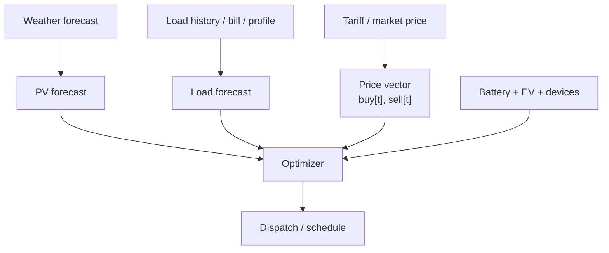
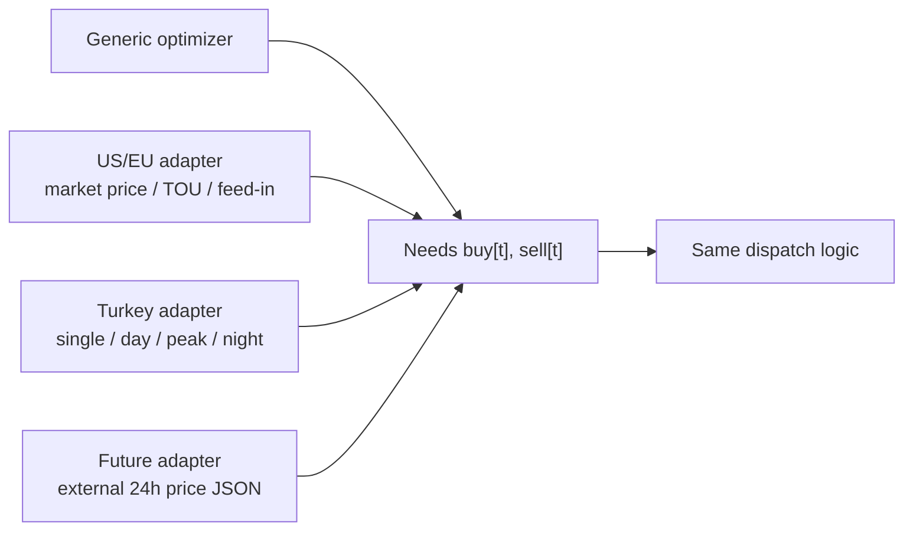
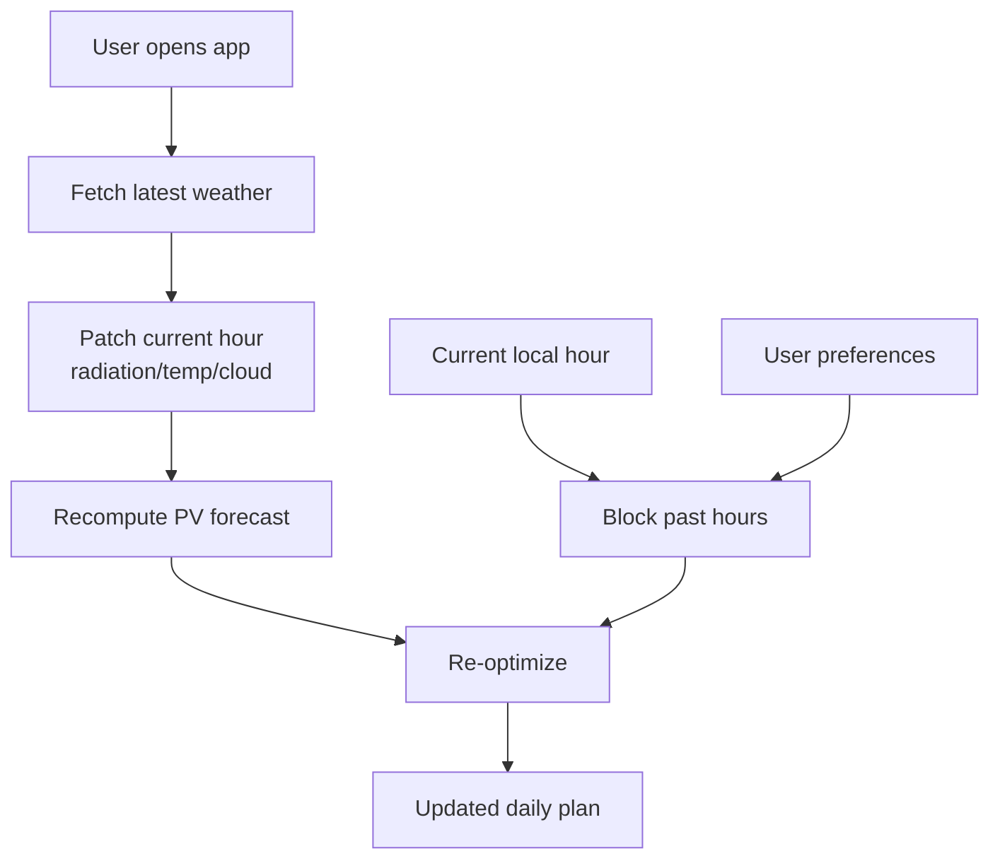

# Enerji Optimizasyonu Araştırma Notu

Bu not Voltaic'in teknik yönünü netleştirir: dünyadaki ev enerji yönetimi
sistemleri nasıl çalışır, biz bunu Türkiye tarifesine nasıl uyarlıyoruz ve ürün
anlık değişimlere nasıl tepki verir.

## 1. Endüstride Problem Nasıl Kurulur?

Güneş paneli + batarya + esnek yük optimizasyonu genelde aynı matematiksel
iskeleti kullanır:

1. Önümüzdeki zaman ufku için PV üretimi tahmin edilir.
2. Aynı ufuk için tüketim/load tahmin edilir.
3. Saatlik alış/satış fiyat vektörü alınır.
4. Batarya, EV şarjı ve cihaz çalışma pencereleri kısıt olarak girilir.
5. Toplam maliyeti minimize eden plan seçilir.

Bu yapı ABD ve Avrupa'da daha dinamik görünür çünkü fiyat tarafında real-time
market price, time-of-use tariff, demand charge veya feed-in tariff bulunabilir.
Ama optimizer açısından bunların tamamı sadece `buy_price[t]` ve `sell_price[t]`
vektörüdür.

## 2. Açık Kaynak ve Referans Sistemler

### pvlib

`pvlib`, PV sistem performansını modellemek için kullanılan açık kaynak Python
araç setidir. Modül verimi, ışınım, sıcaklık ve inverter etkileri gibi PV sistem
hesaplarının güvenilir uygulanmış versiyonlarını sağlar.

Kaynak: https://pvlib-python.readthedocs.io/

### NREL SAM / PySAM

NREL'in System Advisor Model'i PV, batarya ve finansal fizibilite için yaygın
referans araçtır. PySAM ise SAM modellerinin Python wrapper'ıdır. SAM/PySAM
batarya dispatch stratejilerinde fiyat sinyali, yük tahmini, PV tahmini ve
batarya kısıtlarını birlikte kullanır.

Kaynaklar:

- https://sam.nlr.gov/
- https://nrel-pysam.readthedocs.io/en/main/modules/Battery.html
- https://www.nrel.gov/docs/fy21osti/79575.pdf

### EMHASS

EMHASS, Home Assistant ile entegre çalışan bir ev enerji yönetim sistemidir.
Güneş üretimi, tüketim, elektrik fiyatı, batarya ve deferrable load bilgileriyle
lineer programlama tabanlı optimizasyon yapar.

Kaynaklar:

- https://emhass.readthedocs.io/
- https://github.com/davidusb-geek/emhass
- https://emhass.readthedocs.io/en/latest/config.html

## 3. Türkiye'ye Uyarlama

ABD/Avrupa örneklerinde fiyat değişkeni çoğu zaman saatlik borsa veya perakende
dinamik fiyatıdır. Türkiye MVP'sinde ise fiyat yapısı daha düzenlidir:

- Tek zamanlı tarifede fiyat gün içinde sabittir.
- Üç zamanlı tarifede fiyat üç bloktur: gündüz, puant, gece.
- Saatlik mahsuplaşma nedeniyle satış fiyatı alış fiyatından düşüktür.

Bu yüzden Türkiye uyarlamasında optimizer değişmez. Sadece fiyat adapter'ı değişir.

Kod karşılığı:

- Default adapter: `backend/app/tools/tariff.py`
- Türkiye sabitleri: `backend/app/config.py`
- Harici fiyat vektörü hook'u: `VOLTAIC_PRICE_VECTOR_FILE`

Bu tasarım sayesinde ileride EPİAŞ veya başka bir dinamik sinyal kullanılacaksa
optimizer yeniden yazılmaz; sadece 24 elemanlı fiyat vektörü beslenir.

## 4. Anlık Değişimlere Adaptasyon

Voltaic'te anlık değişim üç yerden gelir:

1. **Hava:** Open-Meteo bugünün current koşullarını ve saatlik forecast'i verir.
2. **Zaman:** Bugün için geçmiş saatler otomatik bloklanır.
3. **Kullanıcı:** İtirazlar ve tercihler `blocked_hours` olarak optimizasyona girer.

Bu nedenle plan statik değildir. Her plan çağrısı yeniden hesaplanır ve o andaki
hava/zaman durumuna göre farklı sonuç verebilir.

## 5. ML Modelinin Rolü

Voltaic'te LLM karar verici değildir. Maliyet düşürme iddiası şu modellere dayanır:

- PV üretim modeli: hava girdili.
- Tüketim modeli: smart-meter shape + fatura kalibrasyonu.
- Tarife modeli: Türkiye adapter'ı veya dış fiyat vektörü.
- Optimizer: maliyet minimizasyonu.

LLM sadece planı açıklar, itirazı anlar, hafızaya yazar ve kullanıcı deneyimini
iyileştirir.

## 6. Geliştirme Yönü

Bu araştırmadan çıkan uygulama kararları:

- PV üretim modeli mutlaka hava girdili kalmalı.
- Tüketim modeline sıcaklık etkisi eklenmeli.
- Cihaz katalogu gerçekçi güç/süre varsayımları taşımalı.
- EV şarjı ayrı ve büyük esnek yük olarak modellenmeli.
- Türkiye fiyatı sabit olsa bile optimizer generic price-vector tasarımında kalmalı.
- Plan her app açılışında veya refresh'te yeniden optimize edilmeli.

## 7. Performans ve Maliyet Düşürme Stratejileri

Kodda uygulanan performans kararları:

- Model artifact JSON'ları process içinde cache'lenir; her plan çağrısında diskten
  tekrar okunmaz.
- Optimizer 24 saatlik küçük ufukta önce greedy yerleşim yapar, sonra coordinate
  descent ile cihazları tekrar iyileştirir. Bu, brute-force kombinasyon patlamasına
  girmeden çoklu cihaz çakışmalarını azaltır.
- Bugünün geçmiş saatleri hem cihaz hem batarya dispatch için bloklanır. Böylece
  hesaplanan plan uygulanabilir kalır.
- Harici fiyat vektörü adapter'ı optimizer'ı değiştirmeden fiyat kaynağı değişimini
  sağlar.

Maliyet düşürme kararları:

- Tek zamanlı tarifede ana kazanç, saatlik mahsuplaşma nedeniyle güneş üretimini
  aynı saatte tüketmektir.
- Üç zamanlı tarifede cihazlar puanttan uzak tutulur; bazen gece fiyatı, gündüz
  satış gelirinden daha avantajlıysa yük geceye kayabilir.
- EV gibi büyük yükler önce planlanır; çünkü toplam maliyet etkisi küçük cihazlara
  göre çok daha yüksektir.
- Batarya güneş fazlasıyla şarj edilir ve pahalı ithalat saatlerinde deşarj edilir.
